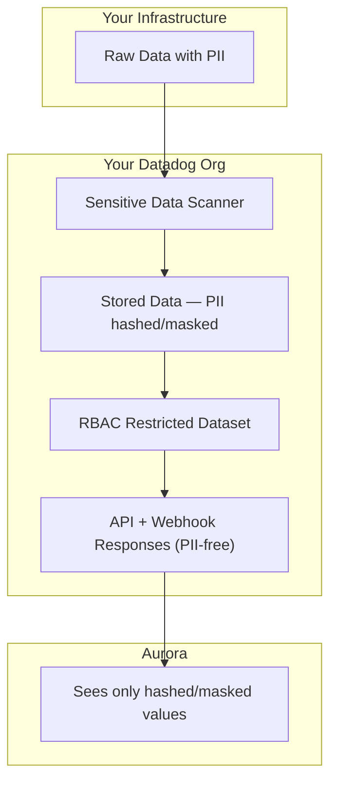

# Datadog Data Access

> **Purpose:** Ensure that no Personally Identifiable Information (PII) reaches Aurora when connecting your Datadog environment. This guide walks through configuring Datadog-side controls so Aurora never processes identifiable personal data — keeping you compliant with GDPR, CCPA, and similar regulations without Aurora becoming a data processor.

## Overview

Aurora connects to your Datadog via two data paths:

1. **Webhooks (push):** Datadog sends alert payloads to Aurora when your monitors fire.
1. **API queries (pull):** Aurora's RCA agent queries your Datadog for logs, metrics, traces, events, monitors, hosts, and incidents.

## Architecture



---

## Step 1: Configure Sensitive Data Scanner

The Sensitive Data Scanner applies at **ingestion time** — all downstream consumers (including API responses and webhooks) see the sanitized data.

### 1.1 Create a Scanning Group

1. Navigate to **Organization Settings → Sensitive Data Scanner**
  - Direct link: `https://app.datadoghq.com/sensitive-data-scanner/configuration/telemetry`
1. Click **+ Add Scanning Group**
1. Configure:
  - **Name:** `PII Protection - Aurora Integration`
  - **Query filter:** `*` (all data) or scope to specific services if preferred
  - **Enable scanning for:** Logs, APM Spans, Events
  - **Sampling rate:** `100%` (required for Hash/Mask actions)

> **Important:** Hashing and masking require 100% sampling. If sampling is below 100%, these actions are unavailable.

### 1.2 Add Scanning Rules

Click **+ Add Scanning Rule** → **Add Library Rules**. Datadog provides 90+ predefined rules organized into four categories:


| Category                                    | What it covers                                                                | Recommendation                            |
| ------------------------------------------- | ----------------------------------------------------------------------------- | ----------------------------------------- |
| **Personal Identifiable Information (PII)** | Emails, phone numbers, SSNs, human names, passport numbers, driver's licenses | Enable all rules in this category         |
| **Credit Cards and Banking**                | Credit card numbers (Visa, Mastercard, Amex, etc.), IBANs, routing numbers    | Enable all rules (especially for PCI-DSS) |
| **Secrets and Credentials**                 | API keys, tokens, passwords, AWS secret keys, private keys                    | Enable all rules                          |
| **Network and Device Information**          | IPv4/IPv6 addresses, MAC addresses, HTTP auth headers                         | Enable all rules                          |


**Quickest setup:** Select the entire **PII** and **Network and Device Information** categories at minimum. For full compliance coverage, enable all four categories.

For each rule:

1. Under **Action on Match**, select **Entire Event** to scan all fields
1. Under **Define actions on match**, select **Hash** (irreversible FarmHash fingerprint) or **Mask** (logs only, reversible by privileged users in your org)

### 1.3 Add Custom Rules (Optional)

For organization-specific PII patterns, add custom regex rules:

```regex
# Employee names (if they appear in logs)
\b(John|Jane|FirstName)\s+(Smith|Doe|LastName)\b

# Internal account numbers
ACCT-[0-9]{6,10}

# Custom user ID formats that map to real identities
usr_[a-f0-9]{8}-[a-f0-9]{4}
```

### 1.4 Hash vs. Mask Decision Matrix


| Action   | Reversible?                                 | Who can see original?              | Available for     | Best for                                                                  |
| -------- | ------------------------------------------- | ---------------------------------- | ----------------- | ------------------------------------------------------------------------- |
| **Hash** | No — uses 64-bit FarmHash                   | Nobody                             | Logs, APM, Events | Fields where nobody needs the original value after ingestion              |
| **Mask** | Yes — with `Data Scanner Unmask` permission | Users in your org with Unmask role | Logs only         | Fields where your team still needs access, but Aurora should not see them |


**Recommendation:** Use **Mask** for logs (your team retains access, Aurora cannot see originals), **Hash** for APM spans and events (irreversible but those are rarely inspected field-by-field).

---

## Step 2: Configure Aurora's Service Account (Role-Based Access)

Create a dedicated Datadog service account for Aurora with restricted permissions. Restriction Queries attach to **roles**, and roles attach to **service accounts**. The App Key is then created under the service account.

### 2.1 Create a Custom Role for Aurora

1. Go to **Organization Settings → Roles**
1. Click **New Role**
1. Name: `Aurora Restricted`
1. Grant permissions:
  - `logs_read_data` — required for log queries
  - `logs_read_index_data` — required for log search
  - `monitors_read` — required for monitor queries
  - `events_read` — required for event queries
1. **Do NOT grant:**
  - `data_scanner_unmask` — this would let Aurora see masked PII
  - `logs_write_*` — Aurora should never write to your Datadog
  - `user_access_manage` — Aurora should not modify access controls
1. Click **Save**

### 2.2 Restricted Dataset (Optional — Only If You Already Tag PII Services)

If your logs are already tagged to indicate which services handle PII (e.g., `service:user-auth`, `data_classification:pii`), you can add an extra access layer:

1. Go to **Organization Settings → Data Access Control**
1. Click **New Restricted Dataset**
1. Name it, select **Logs**, and filter on your existing PII-related tag
1. Grant access to your team's roles. Do NOT grant access to the `Aurora Restricted` role.

> **Note:** This only works with pre-existing tags — Restricted Datasets cannot filter on log content or attributes. If your services aren't already tagged by data sensitivity, skip this step. The Sensitive Data Scanner (Step 1) is sufficient on its own.

### 2.3 Create a Service Account

Service accounts are bot users that own API keys independently of any human user.

1. Go to **Organization Settings → Service Accounts**
1. Click **+ New Service Account**
1. Name: `Aurora Integration`
1. Assign the `Aurora Restricted` role to this service account

### 2.4 Create API + App Keys Under the Service Account

Follow the [Datadog connector setup guide](../integrations/connectors.md#datadog) to create API and Application keys, but create them **under the service account** (not your personal user) so they inherit the `Aurora Restricted` role.

The flow is:

```text
Restriction Query → attached to Role → assigned to Service Account → App Key inherits all restrictions
```

---

## Step 3: Verification

### 3.1 Send a Test Log with Known PII

```bash
curl -X POST "https://http-intake.logs.datadoghq.com/api/v2/logs" \
  -H "DD-API-KEY: <YOUR_API_KEY>" \
  -H "Content-Type: application/json" \
  -d '[{
    "message": "User john.smith@acme.com login failed from 203.0.113.42 phone 555-123-4567",
    "service": "aurora-pii-test",
    "source": "test",
    "ddtags": "env:test"
  }]'
```

### 3.2 Verify in Datadog Log Explorer (Your View)

Search for `service:aurora-pii-test`. If you have the Unmask permission, you will see the original values. Without Unmask permission, you will see masked values.

### 3.3 Verify via Aurora's Service Account Keys

Use the API key and App key you created for Aurora in Step 2.4:

```bash
curl -X POST "https://api.datadoghq.com/api/v2/logs/events/search" \
  -H "DD-API-KEY: <AURORA_API_KEY>" \
  -H "DD-APPLICATION-KEY: <AURORA_APP_KEY>" \
  -H "Content-Type: application/json" \
  -d '{
    "filter": {
      "query": "service:aurora-pii-test",
      "from": "now-1h",
      "to": "now"
    },
    "page": {"limit": 5}
  }'
```

**Expected result:** PII fields should appear as hashed/masked values:

```text
"User 8a3f9c2b1d4e7f60 login failed from b7e2a1c9d3f84052 phone c4e8a2f19b3d7061"
```

If raw PII appears, check:

- The scanning group's filter query matches the test service
- Sampling is set to 100%
- The App Key was created under the Aurora service account (not under your admin user)

### 3.4 Verify Webhook Path

Trigger a test monitor that fires on `service:aurora-pii-test`. Check the payload received by Aurora's webhook endpoint. PII should already be hashed/masked since the Sensitive Data Scanner processed it at ingestion.

---

## See Also

- [Datadog Connector Setup](../integrations/connectors.md#datadog) — How to connect Aurora to Datadog (API keys, webhooks, site configuration)
- [Datadog Sensitive Data Scanner](https://docs.datadoghq.com/security/sensitive_data_scanner/)
- [Datadog Service Accounts](https://docs.datadoghq.com/account_management/org_settings/service_accounts/)
- [Datadog Restricted Datasets (RBAC)](https://docs.datadoghq.com/data_security/logs/#restricted-datasets)

:::tip
If you haven't connected Datadog to Aurora yet, start with the [Datadog connector setup guide](../integrations/connectors.md#datadog) first, then return here to configure PII filtering.
:::
